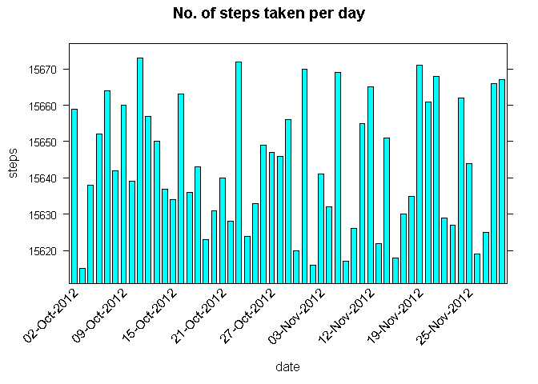

# Reproducible Research: Peer Assessment 1


## Loading and preprocessing the data

Load the file **"activity.csv"**

As an illustration, we have staged the file in the working directory **"C:/Java/05_01_RMarkdowns"**

To execute the code chunk in your environment replace the above working directory with the correct directory as applicable.

**Note: This R Markdown file can be executed as is within RStudio after replacing the above working directory as mentioned**


```r
setwd("C:/Java/05_01_RMarkdowns")
activity <- read.table(file = "activity.csv", header = TRUE, sep = ",")
```

## What is mean total number of steps taken per day?


For this part of the assignment, you can ignore the missing values in the dataset.

1. Make a histogram of the total number of steps taken each day

	**We will use the barchart() function of the package lattice**

	Install the "lattice" library using the command (if not installed) : install.packages("lattice") 

	Load the "lattice" library as we will use the barchart() function : library(lattice) 


```r
library(lattice)
aggByDay <- setNames(aggregate(steps~as.Date(date), activity, sum, na.rm = TRUE), c("date","steps"))
xaxis <- seq(1, nrow(aggByDay), by = 6)
myScale <- list(x = list(rot = 45, cex = 1.0, labels = format(aggByDay$date, "%d-%b-%Y")[xaxis], at = xaxis))
barchart(date ~ steps, data = aggByDay, 
	main = "No. of steps taken per day", 
	ylab = "steps", xlab = "date", scales = myScale, horizontal = F)
```

<!-- -->

2. Calculate and report the mean and median total number of steps taken per day


```r
paste("Mean of total number of steps taken per day:", mean(aggByDay$steps))
```

```
## [1] "Mean of total number of steps taken per day: 10766.1886792453"
```

```r
paste("Median of total number of steps taken per day:", median(aggByDay$steps))
```

```
## [1] "Median of total number of steps taken per day: 10765"
```


## What is the average daily activity pattern?

1. Make a time series plot (i.e. type = "l") of the 5-minute interval (x-axis) and the average number of steps taken, averaged across all days (y-axis)


```r
timeSeriesData <- aggregate(steps ~ interval, data = activity, FUN = mean)
maxRecInd <- which.max(timeSeriesData$steps)
maxRec <-  timeSeriesData [maxRecInd, ]
maxInterval <- maxRec$interval
maxStep <- maxRec$steps


plot(timeSeriesData, type = "l", axes = F, 
	xlab = "Time of the day", 
	ylab = "Average Number of Steps taken", 
	main = "Average Daily Activity Pattern", 
    col = "red")
	
axis(1,at=c(seq(0,2400,100),maxInterval), 
		label = paste(c(seq(0,24,1),8),c(rep(":00",25),":40"),sep=""), pos = 0)
		
axis(2,at=c(seq(0,240,30),maxStep), 
		label = c(seq(0,240,30),maxStep), pos = 0)

noteStr <- paste("max average of steps: (",maxInterval,",",maxStep,")") 
segments(maxInterval, 0, maxInterval, maxStep, col = "blue", lty = "dashed")
text(maxInterval,maxStep, noteStr, col = "blue", adj = c(-.1, -.1))
segments(0, maxStep, maxInterval, maxStep, col = "blue", lty = "dashed")
```

<!-- -->

2. Which 5-minute interval, on average across all the days in the dataset, contains the maximum number of steps?


```r
paste("The 5-minute interval that contains the max number of steps:",maxInterval)
```

```
## [1] "The 5-minute interval that contains the max number of steps: 835"
```

```r
paste("The max number of steps taken:",maxStep)
```

```
## [1] "The max number of steps taken: 206.169811320755"
```

## Imputing missing values

Note that there are a number of days/intervals where there are missing values (coded as NA). The presence of missing days may introduce bias into some calculations or summaries of the data.

1. Calculate and report the total number of missing values in the dataset (i.e. the total number of rows with NAs)


```r
paste("Total number of observations with missing (NA) data in activity:", sum(is.na(activity$steps)))
```

```
## [1] "Total number of observations with missing (NA) data in activity: 2304"
```


2. Devise a strategy for filling in all of the missing values in the dataset. The strategy does not need to be sophisticated. For example, you could use the mean/median for that day, or the mean for that 5-minute interval, etc.

	**Strategy deployed: Missing observations will be replaced with the sample mean (which won't bias the estimates) instead of replacing them by zero (which will)**


3. Create a new dataset that is equal to the original dataset but with the missing data filled in.
The new dataset **newActivity** will have all the missing(**NA**) values replaced with the mean value of steps of the entire **activity** dataset: **mean(activity$steps, na.rm = TRUE)**


```r
newActivity <- activity
newActivity[is.na(activity$steps), ]$steps <- mean(activity$steps, na.rm = TRUE)
paste("Total number of observations with missing (NA) data in newActivity:", sum(is.na(newActivity)))
```

```
## [1] "Total number of observations with missing (NA) data in newActivity: 0"
```

4. Make a histogram of the total number of steps taken each day and Calculate and report the mean and median total number of steps taken per day. Do these values differ from the estimates from the first part of the assignment? What is the impact of imputing missing data on the estimates of the total daily number of steps?

	**We will use the barchart() function of the package lattice**


```r
library(lattice)

newAggByDay <- setNames(aggregate(steps~as.Date(date), newActivity, sum, na.rm = TRUE), c("date","steps"))

xaxis <- seq(1, nrow(newAggByDay), by = 6)

myScaleNew <- list(x = list(rot = 45, cex = 1.0, 
	labels = format(newAggByDay$date, "%d-%b-%Y")[xaxis], at = xaxis))

barchart(date ~ steps, data = newAggByDay, 
	main = "No. of steps taken per day (missing data replaced with mean)", 
	ylab = "steps", xlab = "date", 
	scales = myScaleNew, horizontal = F)
```

<!-- -->

```r
paste("New Mean:", mean(newAggByDay$steps))
```

```
## [1] "New Mean: 10766.1886792453"
```

```r
paste("New Median:", median(newAggByDay$steps))
```

```
## [1] "New Median: 10766.1886792453"
```

```r
paste("Difference in the Mean values:", mean(newAggByDay$steps) - mean(aggByDay$steps, na.rm = TRUE))
```

```
## [1] "Difference in the Mean values: 0"
```

```r
paste("Difference in the Median values:", median(newAggByDay$steps) - median(aggByDay$steps, na.rm = TRUE))
```

```
## [1] "Difference in the Median values: 1.1886792452824"
```

## Are there differences in activity patterns between weekdays and weekends?

For this part the weekdays() function may be of some help here. Use the dataset with the filled-in missing values for this part.

1. Create a new factor variable in the dataset with two levels - "weekday" and "weekend" indicating whether a given date is a weekday or weekend day.
	
	Dataset **newActivity** enhanced with 2 additional columns: **day** and **dayflag**
	
	**dayflag** is the factor variable containing the levels - **weekday** and **weekend**
	

```r
newActivity$date <- as.Date(newActivity$date, "%Y-%m-%d")
newActivity$day <- weekdays(newActivity$date)
newActivity$dayflag <- c("weekday")
for (i in 1:nrow(newActivity)){
	if (newActivity$day[i] == "Saturday" || newActivity$day[i] == "Sunday"){
		newActivity$dayflag[i] <- "weekend"
	}
}
newActivity$dayflag <- as.factor(newActivity$dayflag)
str(newActivity)
```

```
## 'data.frame':	17568 obs. of  5 variables:
##  $ steps   : num  37.4 37.4 37.4 37.4 37.4 ...
##  $ date    : Date, format: "2012-10-01" "2012-10-01" ...
##  $ interval: int  0 5 10 15 20 25 30 35 40 45 ...
##  $ day     : chr  "Monday" "Monday" "Monday" "Monday" ...
##  $ dayflag : Factor w/ 2 levels "weekday","weekend": 1 1 1 1 1 1 1 1 1 1 ...
```
	
2. Make a panel plot containing a time series plot (i.e. type = "l") of the 5-minute interval (x-axis) and the average number of steps taken, averaged across all weekday days or weekend days (y-axis). 
	
	**We will be using qplot() of ggplot2 package. Time series plot is achieved using geom="line"**
	
	Install the "ggplot2" library using the command (if not installed) : install.packages("ggplot2") 
	
	Load the "ggplot2" library as we will use the barchart() function : library(ggplot2) 

	**Note: Specifying geom = "line" causes the data to be sorted by Time before plotting.**


```r
library(ggplot2)
aggByWeekdayEnd <- aggregate(steps ~ interval+dayflag, newActivity, mean)
qplot(interval, steps, data=aggByWeekdayEnd, geom=c("line"), 
	xlab="5-min intervals", 
	ylab="Average no. of steps", 
	main="Patterns of activity on Weekdays VS Weekends") + facet_wrap(~ dayflag, ncol=1)
```

<!-- -->

**The above panel plots clearly shows the differences in activity patterns between weekdays and weekends**


#*Conclusion: There are significant differences in average activity patterns between a weekday Vs a weekend.*
